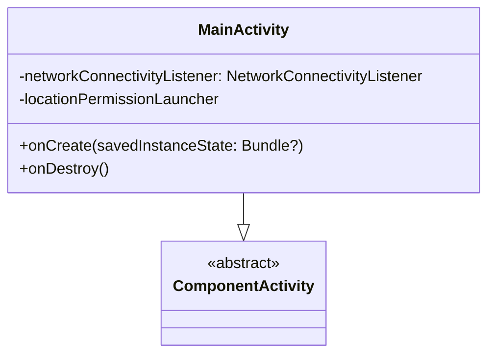

# MainActivity [Class]

## Overview

The `MainActivity` class serves as the main entry point for the Voci app's user interface. It is responsible for managing lifecycle events, requesting permissions, monitoring network connectivity, and setting up the app's navigation and theme.

## Methods

### Lifecycle Functions

- **`onCreate(savedInstanceState: Bundle?)`**

  This function is called when the activity is created. It performs the following tasks:
    - Initializes and starts the `NetworkConnectivityListener` to monitor network changes.
    - Requests necessary permissions for location access.
    - Sets up edge-to-edge screen support.
    - Initializes the app's `ServiceLocator` for dependency injection.
    - Configures the app's theme, navigation, and snackbar support.

  #### Example Highlights:
  ```kotlin
  networkConnectivityListener = NetworkConnectivityListener(applicationContext)
  networkConnectivityListener.startMonitoring()

  Handler(Looper.getMainLooper()).postDelayed({
      if (ContextCompat.checkSelfPermission(this, Manifest.permission.ACCESS_FINE_LOCATION) !=
          PackageManager.PERMISSION_GRANTED
      ) {
          locationPermissionLauncher.launch(Manifest.permission.ACCESS_FINE_LOCATION)
      } else {
          Log.d("LocationPermission", "Permission already granted")
      }
  }, 1000)
  
  setContent {
      val serviceLocator = remember {
          val firestore = FirebaseFirestore.getInstance()
          ServiceLocator.initialize(applicationContext, firestore)
          ServiceLocator.getInstance()
      }

      CompositionLocalProvider(LocalServiceLocator provides serviceLocator) {
          VociAppTheme {
              val navController = rememberNavController()
              val snackbarHostState = remember { SnackbarHostState() }

              Scaffold(
                  bottomBar = {
                      if (currentRoute(navController) !in listOf("signIn", "signUp", "emailVerification", "completeSignUp", "forgotPassword")) {
                          BottomBar(navController)
                      }
                  },
                  snackbarHost = { SnackbarHost(hostState = snackbarHostState) }
              ) { innerPadding ->

                  val authState by serviceLocator.obtainAuthViewModel().authState.collectAsState()

                  LaunchedEffect(authState) {
                      if (authState == AuthState.Unauthenticated) {
                          navController.navigate("signIn") {
                              popUpTo(0) { inclusive = true }
                          }
                      }
                  }

                  NavGraph(
                      navController = navController,
                      paddingValues = innerPadding,
                      snackbarHostState = snackbarHostState
                  )
              }
          }
      }
  }
  ```

- **`onDestroy()`**

  Cleans up resources by stopping the `NetworkConnectivityListener` when the activity is destroyed.

  #### Example - onDestroy():
  ```kotlin
  override fun onDestroy() {
      super.onDestroy()
      networkConnectivityListener.stopMonitoring()
  }
  ```

### Permission Handling

- **`locationPermissionLauncher`**

  Registers a callback to handle the result of the location permission request.
    - If granted, logs and enables access to location data.
    - If denied, logs and handles the denial appropriately.

  #### Example - locationPermissionLauncher:
  ```kotlin
  private val locationPermissionLauncher =
      registerForActivityResult(
          ActivityResultContracts.RequestPermission()
      ) { isGranted: Boolean ->
          if (isGranted) {
              Log.d("LocationPermission", "Permission granted")
          } else {
              Log.d("LocationPermission", "Permission denied")
          }
      }
  ```

### Helper Functions

- **`enableEdgeToEdge()`**

  Configures the app's layout to support edge-to-edge display.

- **`currentRoute(navController: NavController): String?`**

  Helper function to retrieve the current route from the `NavController`.

## Usage

The `MainActivity` serves as the root activity of the application. It initializes critical components and manages permissions and navigation seamlessly. It also ensures that network connectivity changes are monitored and handled appropriately.

### Example Setup:
```kotlin
class MainActivity : ComponentActivity() {
    override fun onCreate(savedInstanceState: Bundle?) {
        super.onCreate(savedInstanceState)
        setContent {
            VociAppTheme {
                // App content
            }
        }
    }
}
```

## Known Limitations

- **Permission Requests:**
    - Permission requests are delayed by a fixed duration (1 second), which might not be optimal in all scenarios.

- **Edge-to-Edge Support:**
    - Requires proper handling for devices with display cutouts or rounded corners.

## Notes

- **Dependencies:**
    - Uses `FirebaseFirestore` for backend interactions.
    - Leverages `ServiceLocator` for dependency management.
    - Integrates with `WorkManager` for background tasks.

## Future Improvements

- Optimize permission handling by introducing more dynamic timing and contextual messaging.
- Enhance edge-to-edge support for better compatibility with various devices.
- Refactor network monitoring to use modern APIs or libraries for improved reliability.

## Diagram

### MainActivity Class Diagram


