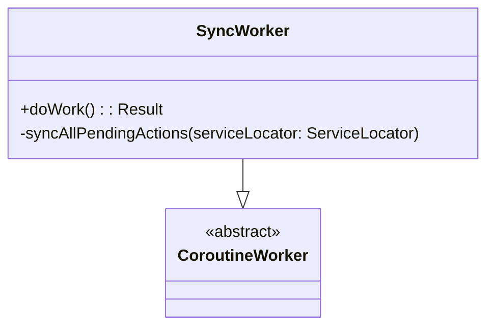

# SyncWorker [Class]

## Overview

The `SyncWorker` class is responsible for synchronizing data in the background. It is used to perform periodic or one-time synchronization of data between the local database and remote data sources. This class leverages coroutines for asynchronous operations and the `WorkManager` library for scheduling and managing the work.

## Methods

### Primary Functions

- **`doWork(): Result`**
  Executes the main synchronization task when the worker is invoked by `WorkManager`.
    - Logs the start and completion of the worker.
    - Retrieves dependencies from the `ServiceLocator`.
    - Synchronizes all pending actions.
    - Returns a `Result` indicating the success or failure of the synchronization task.

  #### Example Usage - doWork():
  ```kotlin
  override suspend fun doWork(): Result {
      Log.d("SyncWorker", "SyncWorker started")
      return try {
          val serviceLocator = ServiceLocator.getInstance()
          syncAllPendingActions(serviceLocator)
          Result.success()
      } catch (e: Exception) {
          Log.e("SyncWorker", "SyncWorker failed", e)
          Result.retry()
      }
  }
  ```

- **`syncAllPendingActions(serviceLocator: ServiceLocator)`**
  Handles the synchronization of pending actions for various repositories. Uses `coroutineScope` and `async` to launch concurrent synchronization tasks. Awaits the completion of all tasks before proceeding.

  #### Example Usage - syncAllPendingActions():
  ```kotlin
  private suspend fun syncAllPendingActions(serviceLocator: ServiceLocator) {
      coroutineScope {
          val homelessDeferred = async { serviceLocator.obtainHomelessRepository().syncPendingActions() }
          val volunteerDeferred = async { serviceLocator.obtainVolunteerRepository().syncPendingVolunteerActions() }
          val requestDeferred = async { serviceLocator.obtainRequestRepository().syncPendingActions() }
          val updateDeferred = async { serviceLocator.obtainUpdatesRepository().syncPendingActions() }
          val preferenceDeferred = async { serviceLocator.obtainVolunteerRepository().syncPendingPreferenceActions() }

          awaitAll(homelessDeferred, volunteerDeferred, requestDeferred, updateDeferred, preferenceDeferred)
      }
  }
  ```

## Usage

The `SyncWorker` class is typically used in conjunction with the `WorkManager` to schedule background synchronization tasks. It retrieves data synchronization tasks from the `ServiceLocator` and executes them concurrently using coroutines.

### Example Setup:
```kotlin
val syncRequest = PeriodicWorkRequestBuilder<SyncWorker>(15, TimeUnit.MINUTES)
    .setConstraints(Constraints.Builder().setRequiredNetworkType(NetworkType.CONNECTED).build())
    .build()
WorkManager.getInstance(context).enqueue(syncRequest)
```

## Known Limitations

- **Error Handling:**
    - Errors in individual repository synchronization tasks are logged but not handled individually. This might result in retries for the entire synchronization job.

- **Resource Usage:**
    - Running multiple synchronization tasks concurrently may consume significant system resources.

## Notes

- **Dependencies:**
  Relies on `ServiceLocator` to fetch repository instances for handling specific synchronization actions (`HomelessRepository`, `VolunteerRepository`, `RequestRepository`, `UpdatesRepository`).

## Future Improvements

- Implement fine-grained error handling to retry specific repository sync operations without affecting others.
- Optimize resource usage by dynamically determining which repositories require synchronization based on pending actions.
- Introduce better logging and monitoring to track individual synchronization task performance.

## Diagram

### SyncWorker Class Diagram



The `SyncWorker` class extends the `CoroutineWorker` base class and overrides its `doWork` method to implement custom synchronization logic.
