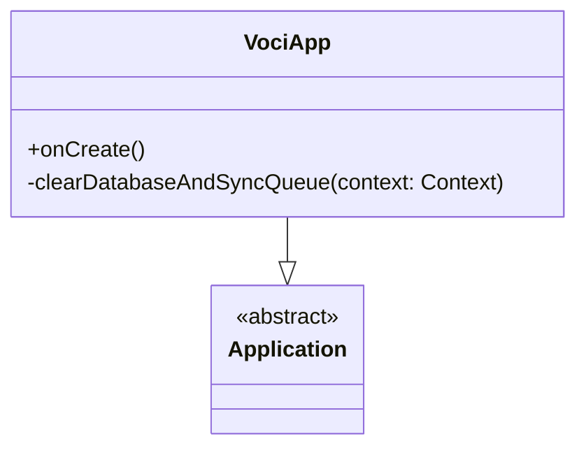

# VociApp [Class]

## Overview

The `VociApp` class serves as the custom `Application` class for the Voci app. It is responsible for initializing the `ServiceLocator`, which provides access to the app's core dependencies, and offers utility methods for debugging purposes, such as clearing the database and sync queue.

## Methods

### Lifecycle Functions

- **`onCreate()`**

  Invoked when the application is created. This function initializes the `ServiceLocator` with the application context and a Firebase Firestore instance.

  #### Example - onCreate():
  ```kotlin
  override fun onCreate() {
      super.onCreate()

      // Uncomment for debugging purposes:
      // clearDatabaseAndSyncQueue(context = applicationContext)

      ServiceLocator.initialize(this, FirebaseFirestore.getInstance())
  }
  ```

### Debugging Functions

- **`clearDatabaseAndSyncQueue(context: Context)`**

  Clears all tables in the local Room database and cancels all pending WorkManager tasks. This function is designed for debugging and should not be called in production.

  #### Example - clearDatabaseAndSyncQueue():
  ```kotlin
  private fun clearDatabaseAndSyncQueue(context: Context) {
      CoroutineScope(Dispatchers.IO).launch {
          val db = VociAppRoomDatabase.getDatabase(context)
          db.clearAllTables()
          WorkManager.getInstance(context).cancelAllWork()
      }
  }
  ```

## Usage

The `VociApp` class acts as the foundation for the app's dependency injection setup and debugging utilities. It ensures that critical components like `ServiceLocator` are properly initialized during app startup.

### Example Setup:
```kotlin
class VociApp : Application() {
    override fun onCreate() {
        super.onCreate()
        ServiceLocator.initialize(this, FirebaseFirestore.getInstance())
    }
}
```

## Notes

- **Dependencies:**
    - Relies on `FirebaseFirestore` for cloud database interactions.
    - Uses `WorkManager` for managing background tasks.

## Known Limitations

- **Debugging Functions:**
    - The `clearDatabaseAndSyncQueue` method should only be used in a controlled environment, as it deletes all data and cancels tasks.

## Diagram

### VociApp Class Diagram


